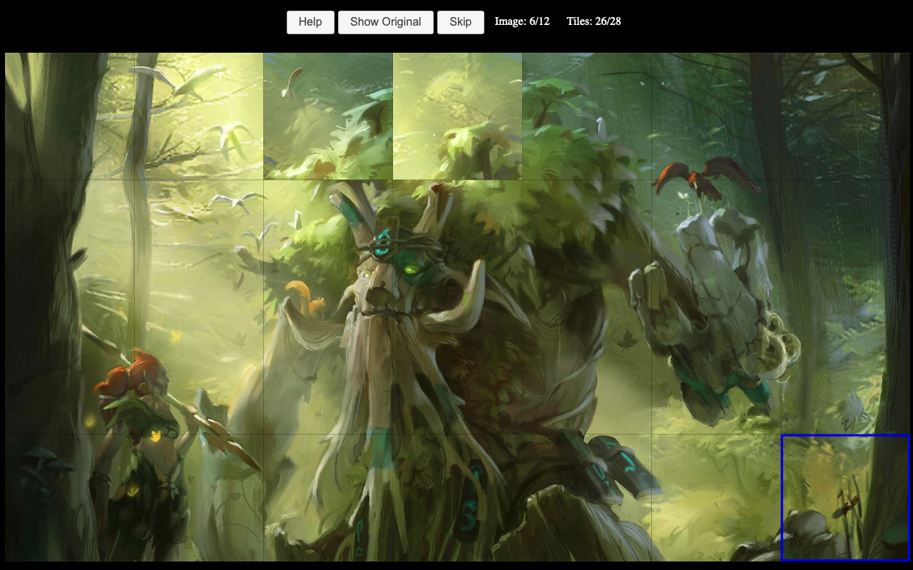

# [Try it out here!](http://nbpt.eu/games/image_puzzle/)

# Info

Click on a tile to select it (that tile will have a red border), and then on other tile to switch the position between them. Keep doing that until all the tiles are placed correctly.

# Images

The images are from the games `dota 2` and `team fortress 2`.

# Commands

-   `npm start`
-   `npm run build`
-   `npm run test`

# Libraries

-   createjs / easeljs
-   jquery
-   jqueryui
    -   button
    -   dialog
    -   base theme
